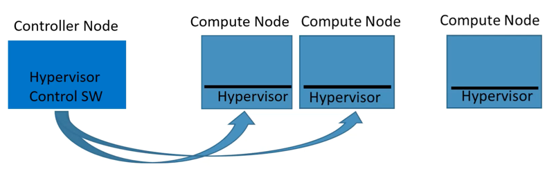

##OpenStack

Cloud Operating System `(compute, storage, networking resource pool을 관리)`

관리 서비스는 공통 인증 메커니즘의 기반한 RestFul API가 기반이다.

Virtual Machine 서비스를 위한 Orchestration

  

Controller Node:
- Compute Node 어디에 VM을 생성해주세요.
- 요구들의 교통정리와 상황정보 보관소

1. RESTFul APi를 통해 create를 요청(`Controller Node`)
2. Controller 노드와 map 방식으로 Compute node에 VM 생성

### Nova (Compute)

### Neutron (Networking)

### KeyStone

### Glance

### Horizon

### Storage

