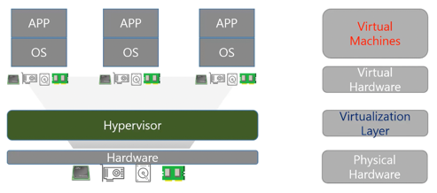
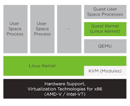
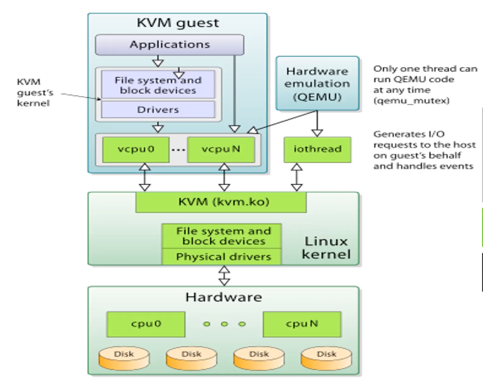
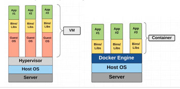

## Virtualization
컴퓨터에서 CPU, Memory, I/O등의 물리적인 리소스를 **추상화** 하는, 즉 물리적인 자원을 논리적인 자원으로 보이게 하는 기술

<p align="center">
  
</p>

```
Virtual Machine은 하드웨어 측면에서 하나의 CPU, Memory, I/O 장치를 Virtualization layer 에서 소프트웨어(Hypervisor) Physical 하드웨어를 독립적으로 논리적으로 하드웨어를 쪼개는 기술
```

## Hypervisor
`가상화를 시켜주는 소프트웨어`

호스트 컴퓨터에서 다수의 운영체제를 동시에 실행하기 위해 하드웨어 자원을 논리적 플랫폼으로 가상화해 주는 소프트웨어
    
1. Type 1 (Native or Bare metal)

    - 호스트의 하드웨어 상에서 바로 동작하며, 게스트 OS를 관리

    - CPU가 가상화를 지원해야 함

    - KVM(**Linux에 같이 포함됨**)

2. Type 2 (Hosted)

   - 호스트의 OS상에서 Hypervisor 동작
   
   - Hypervisor는 OS를 통해 H/W를 호출

   - VirtualBox, VMware Desktop

   - QEMU


<p align="center">
  
</p>

CPU와 관련된 가상화는 KVM에서 처리
CPU와 관련된 가상화는 QEMU에서

1. Guest가 프로세스를 실행시킴
2. Guest 커널에서 시스템 콜이 발생
3. Guest 커널은 리눅스 커널에 있는 KVM을 통해 하드웨어로 명령을 실행


### KVM (Kernel based Virtual Machine)
`리눅스OS에 포함된 Hypervisor`

- Type 1 hypervisor이며 전가상화이다.

- CPU 전체를 KVM이 CPU를 슬라이싱해서 제공을 하는 것


### QEMU (HW emulator)
```
QEMU는 사용자 공간 내에서 실행되고 가상 하드웨어 에뮬레이션을 수행한다. 
사용자 공간 프로그램이 다양한 프로세서의 하드웨어 가상화 기능에 액세스할 수 있습니다.

왜냐하면?
📌 "에뮬레이션" 은 하드웨어를 소프트웨어적으로 구현해 특정 실행 환경을 제공하는 것이다.  

지금에서는 기술적으로 발전을 해서 QEMU의 Emulation 없이 intel-VT, 즉 하드웨어에서 명령어를 그대로 받아 들임
```

<p align="center">
  
</p>

### Full Virtualization vs Para Virtualization

1. Para-Virtualization
   1. OS 및 하드웨어 드라이버들은 가상화된 환경이라는 것을 인지한다
   2. 따라서 원래의 Hardware로 보내기전에 코드를 하드웨어에 맞게 Binary Patching 을 해야 한다. `OverHead`

 ```
 하드웨어를 완전히 가상화하지 않음 - Guest OS에서 직접 하드웨어 제어가 안되고 하이퍼바이저를 통해 제어
 그래서 Guest OS는 원래 OS로부터 일부 수정된 것들이 사용됨
 EX) QEMU
 ```

2. Full Virtualization
   1. OS 및 하드웨어 드라이버들은 가상화된 환경이라는 것을 인지하지 못 한다.
   2. OS 및 드라이버들은 원래의 환경에서 작동된다.

```
하드웨어 전체를 가상화 그래서 Guest OS는 Original OS의 변경 없이 사용 가능
```


### Libvirt
```
가상화 플랫폼(하이퍼바이저)을 관리하는 오픈소스 라이브러리, 다양한 하이퍼바이저 환경을 통합적으로 위해 탄생

Virtualization을 관리하는 API 라이브러리
```


### OS를 가상화?
📌 컨테이너

<p align="center">
  
</p>

VM
- Host OS 위에서 Hypervisor를 통해 자원을 가상화 하여 VM을 동작

- Host OS 위에 Guest OS 가 동작하는 구조

Container
- Host OS에서 프로세스를 위한 공간을 별도로 분리

- 기본적인 Binary, Library 만을 guest os 대신 사용

```
Host OS에서 그냥 구분 없이 돌아가면, 독립된 환경이 아니다.
컨테이너 환경에서 독립되게 만들어주려면, Docker Engine(컨테이너화 시켜주는 engine)

수많은 서버가 모여 있는 센터- IDC (Internet Date Center)
✔ 수많은 가상머신, 컨테이너 모여 있는 센터 - 클라우드
서버들 속에 hypervisor, Container Engine이 만드는 VM, Container 운용, 관리